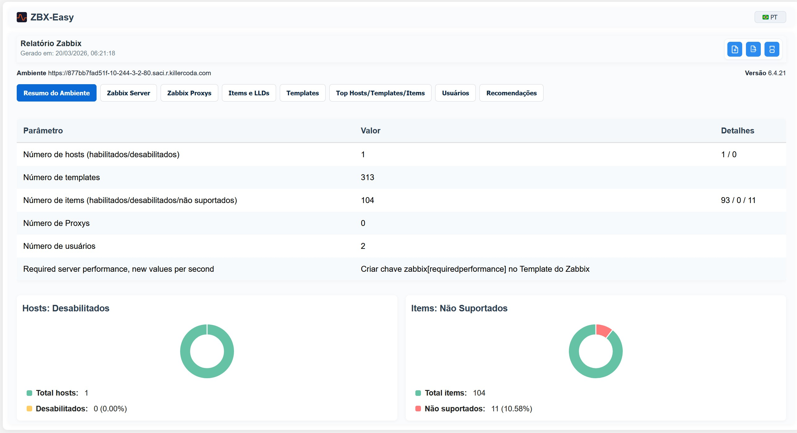

[](https://github.com/bernardolankheet/zabbix-easy/actions/workflows/docker-publish.yml)
[](https://github.com/bernardolankheet/zabbix-easy/releases)
[](https://hub.docker.com/r/bernardolankheet/zabbix-easy)
[](LICENSE)

# Zabbix Easy Report

Zabbix Easy is an open-source tool that analyzes a Zabbix environment via the Zabbix API and generates a concise HealthCheck report with actionable recommendations to improve performance, reliability and maintenance.

Compatibility Zabbix:
- 6.0
- 6.4
- 7.0
- 7.2
- 7.4
- 8.0 (experimental)

## Quick summary
- Backend language: Go
- Frontend: HTML/CSS/JS (server-generated)
- Documentation: MkDocs (in the `docs/` folder)



## Main features
- Data collection and aggregation via the Zabbix API
- Analysis: unsupported items, items without templates, server pollers/processes and proxies, trends, LLD
- Automated recommendations with fix snippets
- Export to HTML/PDF
- Optional persistence of reports (Postgres)

## Quick start — run locally

### 1) Using Docker (easiest):

```bash
docker run -d --name zabbix-easy -p 8080:8080 -e MAX_CCONCURRENT=10 -e ZABBIX_SERVER_HOSTID=10084 -e CHECKTRENDTIME=15d bernardolankheet/zabbix-easy:latest
# open http://localhost:8080
```

### 2) Running with data persistence (Postgres):

```bash
docker compose --profile db up --build -d
docker run -d --name zabbix-easy -p 8080:8080 -e MAX_CCONCURRENT=10 -e ZABBIX_SERVER_HOSTID=10084 -e CHECKTRENDTIME=15d bernardolankheet/zabbix-easy:latest
# open http://localhost:8080
```

## Documentation
- [https://bernardolankheet.github.io/zabbix-easy](https://bernardolankheet.github.io/zabbix-easy)

## Contributing
- Open issues and PRs. See `docs/en/contribution.md` for i18n, development and local docs guidelines.

## Contact and license
- Repository: [https://github.com/bernardolankheet/zabbix-easy](https://github.com/bernardolankheet/zabbix-easy)
- License: see `LICENSE`

## Changelog
- See `CHANGELOG.md` for recent changes and upgrade notes.