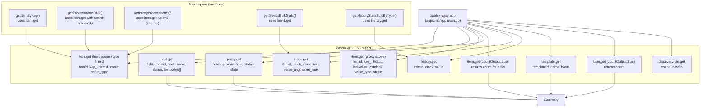

# Usage

This page documents how the report generation works and the main API calls used.

## Diagram: Zabbix API Calls

```mermaid
flowchart TD
  App["zabbix-easy app\n(app/cmd/app/main.go)"]

  subgraph ZabbixAPI["Zabbix API (JSON-RPC)"]
    HostGet["host.get\nfields: hostid, host, name, status, templates[]"]
    ProxyGet["proxy.get\nfields: proxyid, host, status, state"]
    ItemGetProxy["item.get (proxy scope)\nitemid, key_, hostid, lastvalue, lastclock, value_type, status"]
    ItemGetHost["item.get (host scope / type filters)\nitemid, key_, hostid, name, value_type"]
    ItemGetCount["item.get (countOutput:true)\nreturns count for KPIs"]
    TrendGet["trend.get\nitemid, clock, value_min, value_avg, value_max"]
    HistoryGet["history.get\nitemid, clock, value"]
    TemplateGet["template.get\ntemplateid, name, hosts"]
    UserGetCount["user.get (countOutput:true)\nreturns count"]
    DiscoveryGet["discoveryrule.get\ncount / details"]
  end

  subgraph Helpers["App helpers (functions)"]
    getItemByKey["getItemByKey()\nuses item.get"]
    getProcessBulk["getProcessItemsBulk()\nuses item.get with search wildcards"]
    getProxyProc["getProxyProcessItems()\nuses item.get type=5 (internal)"]
    getTrendsBulk["getTrendsBulkStats()\nuses trend.get"]
    getHistoryBulk["getHistoryStatsBulkByType()\nuses history.get"]
  end

  App --> HostGet
  App --> ProxyGet
  App --> ItemGetProxy
  App --> ItemGetHost
  App --> ItemGetCount
  App --> TrendGet
  App --> HistoryGet
  App --> TemplateGet
  App --> UserGetCount
  App --> DiscoveryGet

  getItemByKey --> ItemGetHost
  getProcessBulk --> ItemGetHost
  getProxyProc --> ItemGetHost
  getTrendsBulk --> TrendGet
  getHistoryBulk --> HistoryGet

  HostGet --> Summary
  UserGetCount --> Summary
  ItemGetCount --> Summary
  TemplateGet --> Summary
  ProxyGet --> Summary

  classDef fix fill:#fff4a3,stroke:#e6c800
```
