---
---

**Compatibilidade:** testado e funcionando com Zabbix 6.0, 6.4 e 7.0.


- **Internal Process** → adicione em `procNames`:
```go
procNames := []string{
    ...
    "novo processo",  // ← aqui
}
```

**3. Regra do nome:** use o nome exatamente como aparece na chave do item no Zabbix, com espaço ou underscore. A função `nameToWildcard` converte automaticamente — `"agent poller"` → `"*agent*poller*"` — e casa com `agent poller`, `agent_poller` ou qualquer variante.

---

## Guia 3: Zabbix Proxys (`tab-proxys`)

### O que é

Exibe o status e métricas dos Zabbix Proxies configurados no ambiente. Divide os proxies em: Unknown, Offline, Ativos (Active), Passivos (Passive). Para cada proxy ativo/comunicando exibe itens totais, não suportados e fila de 10 minutos.

### Tabelas exibidas

**Sumário:**

| Descrição | Quantidade |
|-----------|-----------|
| Proxys Unknown | contagem |
| Proxys Offline | contagem |
| Proxys Ativos | contagem |
| Proxys Passivos | contagem |
| Total de Proxys | contagem + link |

**Detalhe por proxy** (somente proxies com `state=2`, comunicando):

| Proxy | Tipo | Total de Itens | Items não suportados | Queue-10m |
|-------|------|----------------|----------------------|-----------|
| nome | Active / Passive | contagem | contagem | valor |

### Chamadas à API do Zabbix

A lista de proxies já foi coletada no início (Resumo). Por proxy ativo, são feitas duas chamadas paralelas:

| Chamada | Parâmetros relevantes | Dado extraído |
|---------|-----------------------|---------------|
| `item.get` | `search:{key_:["*queue,10m*","*items_unsupported*", ...]}, proxyids:<id>, monitored:true` | `lastvalue` de `zabbix[queue,10m]` e `zabbix[items_unsupported]` |
| `item.get` | `countOutput:true, templated:false, proxyids:<id>` | Total de itens monitorados pelo proxy |

### Processos do Proxy — chaves e tipos de item

A detecção de processos dos proxies usa uma chamada `item.get` que procura por *internal items* e *dependent items* (tipos `5` e `18`). Isso garante que a ferramenta encontre tanto chaves no formato "dot-style" (ex.: `process.*.avg.busy`) quanto no formato de função Zabbix (`zabbix[process,*,avg,busy]`), já que a busca compara tanto o campo `key_` quanto o `name`.

Pontos importantes:

- O filtro agora inclui `type: [5, 18]` — Internal (5) e Dependent (18). Antes só eram consultados items `type=5` (internal), o que fazia com que chaves dependentes não fossem retornadas pela API.
- A correspondência usa curingas (wildcards). Por isso usamos padrões como `*availability*manager*` para cobrir ambas as notações.
- Se o relatório mostrar "Nenhum item de processo encontrado", verifique:
  - Se o Template (por exemplo `Zabbix Proxy Health` ou `Remote Zabbix Proxy Health`) está vinculado ao host/proxy.
  - Se o template usa dependent items — no Zabbix, dependent items dependem de um item mestre; confirme que o item mestre existe e está ativo.
  - Para debug, use a API diretamente para listar itens do host com `filter: {"type": [5,18]}` e `searchWildcardsEnabled:true`, por exemplo:

```json
{"jsonrpc":"2.0","method":"item.get","params":{
  "output":"extend",
  "hostids":"<HOSTID>",
  "search":{"key_":["*availability*manager*","*poller*","*trapper*"]},
  "searchByAny":true,
  "searchWildcardsEnabled":true,
  "filter":{"type":[5,18]},
  "monitored":true
},"auth":"<TOKEN>","id":1}
```

Isso retorna tanto itens com `key_` estilo dot quanto os itens dependentes que usam `zabbix[...]` no `name`/`key_`.

Essa mudança corrige casos em que chaves como `process.availability_manager.avg.busy` não eram encontradas porque eram retornadas como dependent items.

### Lógica de versão

#### Tipo do proxy (Active / Passive)

| Campo | Zabbix ≥ 7 | Zabbix 6 |
|-------|-----------|---------|
| Tipo | `operating_mode` (`0`=Active, `1`=Passive) | `status` (`5`=Active, `6`=Passive) |

#### Estado de conectividade (Online / Offline / Unknown)

O Zabbix 7 retorna o campo `state` diretamente no `proxy.get`. O Zabbix 6 **não retorna `state`**, portanto o estado é derivado do campo `lastaccess` (Unix timestamp da última comunicação com o servidor):

| Condição | Estado inferido | Zabbix 7 equivalente |
|----------|----------------|----------------------|
| `state` presente e `state == "2"` | **Online** | `state=2` |
| `state` presente e `state == "1"` | **Offline** | `state=1` |
| `state` presente e `state == "0"` | **Unknown** | `state=0` |
| `state` ausente e `lastaccess == 0` | **Unknown** — nunca conectou | — |
| `state` ausente e `now - lastaccess > 300s` | **Offline** — perdeu conexão | — |
| `state` ausente e `now - lastaccess ≤ 300s` | **Online** | — |

> O threshold de 300 s (5 min) é conservador: proxies ativos reportam ao servidor a cada poucos segundos por padrão.

### Como funciona no código

As linhas por proxy são geradas em goroutines paralelas com o semáforo `sem`. Os resultados são reordenados pelo índice original para manter a ordem de exibição.

---

### Processos e Threads dos Proxys

#### O que é

Exibe a utilização dos processos internos de cada Zabbix Proxy em um accordion por proxy. Para cada processo é mostrado `min`, `avg` e `max` de utilização (%), além de badge **OK** ou **Atenção** no cabeçalho do accordion.

#### Tabela exibida (uma por proxy)

| Coluna | Descrição |
|--------|-----------|
| Processo | Nome com ícone `?` de tooltip com descrição do parâmetro `zabbix_proxy.conf` |
| value_min | Mínimo de utilização no período (`CHECKTRENDTIME`) |
| value_avg | Média de utilização no período |
| value_max | Pico de utilização no período |
| Status | Verde OK / Vermelho Atenção / Cinza não habilitado / Cinza sem dados |

O accordion de cada proxy exibe dois badges no cabeçalho:

- **Online / Offline·Unknown** — estado atual de comunicação com o Zabbix Server
- **OK / Atenção** — pior `value_avg` entre todos os processos com dados

#### Chamadas à API do Zabbix

Cada proxy ativo executa um goroutine independente (controlado pelo semáforo `sem`) com o fluxo a seguir:

##### Step 1 — Descoberta do hostid do proxy (3 tentativas)

O hostid do host de auto-monitoramento do proxy pode diferir do proxyid a partir do Zabbix 7.

| Tentativa | Método | Parâmetros | Quando funciona |
|-----------|--------|-----------|-----------------|
| A | `host.get` | `hostids: [proxyid]` | Zabbix 6 — proxyid == hostid |
| B | `host.get` | `filter: {host: proxyName}` | Zabbix 7 — busca por nome técnico |
| C | `host.get` | `filter: {name: proxyName}` | Zabbix 7 — busca por nome de exibição |
| Fallback | — | usa `proxyid` diretamente | último recurso |

##### Step 2 — `item.get` bulk (1 chamada, todos os processos do proxy)

```json
{
  "method": "item.get",
  "params": {
    "output": ["itemid", "hostid", "name", "key_", "value_type"],
    "hostids": "<hostid resolvido no Step 1>",
    "filter": { "type": 5 }
  }
}
```

- Busca **todos** os itens do tipo `5` (Zabbix internal) do host — sem wildcard na API.
- O match é feito **client-side**: para cada item retornado, testa o padrão `nameToWildcard` contra **`key_` e `name`** do item.
- Checar o campo `name` garante compatibilidade entre Zabbix 6 e 7, já que o `name` ("Utilization of data sender processes, in %") é estável mesmo quando a `key_` muda de formato.

##### Step 3 — `trend.get` bulk (1 chamada, todos os itens do proxy)

```json
{
  "method": "trend.get",
  "params": {
    "output": ["itemid", "value_min", "value_avg", "value_max"],
    "itemids": ["<iid1>", "<iid2>", "..."],
    "time_from": "<agora - CHECKTRENDTIME>",
    "time_to": "<agora>"
  }
}
```

- Agrega múltiplos registros de trend por item: `min(value_min)`, `mean(value_avg)`, `max(value_max)`.
- Itens sem dados no resultado disparam o fallback abaixo.

##### Step 4 — `history.get` fallback (1 chamada por `value_type`, somente itens sem trend)

```json
{
  "method": "history.get",
  "params": {
    "output": ["itemid", "value"],
    "history": "<value_type>",
    "itemids": ["<iids sem trend>"],
    "time_from": "<agora - CHECKTRENDTIME>",
    "time_to": "<agora>",
    "sortfield": "clock",
    "sortorder": "ASC",
    "limit": 20000
  }
}
```

- Agrupa os itens pelo `value_type` e faz uma chamada por tipo (máximo de 20.000 linhas por chamada).
- Calcula `min/avg/max` manualmente a partir dos valores brutos.

#### Funções Go responsáveis

| Função | Descrição |
|--------|-----------|
| `getProxies(apiUrl, token)` | Retorna lista completa de proxies com todos os campos (`output:extend`) |
| `getProxyProcessItems(apiUrl, token, names, hostid)` | Busca todos os itens `type=5` do host; match client-side em `key_` **e** `name` usando `nameToWildcard` |
| `getTrendsBulkStats(apiUrl, token, itemids)` | **1 `trend.get`** para todos os itemids; agrega `min/avg/max` por item |
| `getHistoryStatsBulkByType(apiUrl, token, items)` | Fallback: **1 `history.get` por `value_type`**; agrega `min/avg/max` a partir do histórico bruto |
| `nameToWildcard(name)` | Converte `"data*sender"` → `"*data*sender*"` para match client-side |
| `wildcardMatch(pattern, s)` | Match simples com `*`; usado por `getProxyProcessItems` para testar `key_` e `name` |

#### Lógica de versão

| Zabbix | Processos extras |
|--------|----------------|
| ≥ 7 | Inclui `agent poller`, `browser poller`, `http agent poller`, `snmp poller` |
| 6 | Esses quatro são ignorados na construção da tabela |

#### Lógica de status

| Condição | Exibição |
|----------|----------|
| Proxy offline / unknown | Accordion sem tabela; badge **Offline/Unknown** |
| Nenhum item `type=5` encontrado | Nota com o hostid usado; sem tabela |
| `trend.get` e `history.get` sem dados | Cinza — "Sem dados" |
| Item não encontrado para o processo | Cinza — "Processo não habilitado" |
| `value_avg < 60%` | Verde — OK |
| `value_avg ≥ 60%` | Vermelho — Atenção |

#### Como adicionar um novo processo ao proxy

São **2 lugares** em `cmd/app/main.go`:

**1. `procDesc`** — descrição do tooltip `?` (chave em lowercase, com espaços em vez de `*`):
```go
"novo processo": `Parâmetro "StartNovoProcesso": descrição e quando ajustar.`,
```

**2. `proxyAllProcNames`** — lista de processos do proxy (use **espaços** como separador de palavras, igual ao `pollerNames` do servidor):
```go
proxyAllProcNames := []string{
    "data sender",
    ...
    "novo processo",  // ← aqui
}
// ou exclusivo do Zabbix 7+:
if majorV >= 7 {
    proxyAllProcNames = append([]string{"novo processo"}, proxyAllProcNames...)
}
```

**Por que espaços?** `nameToWildcard` converte espaços em `*` automaticamente ao montar o padrão de busca (`"data sender"` → `"*data*sender*"`). Usar espaços permite que `strings.Fields` conte as palavras corretamente, garantindo que o sort **"mais específico vence"** funcione — sem isso, `"http*agent*poller"` e `"http*poller"` teriam o mesmo word-count de 1 e o sort seria instável, fazendo `"http*poller"` roubar o item de `"http*agent*poller"`.

> **Atenção:** a chave de lookup em `itemsMap` e em `procDesc` usa o nome em **lowercase com espaços** (ex: `"http agent poller"`). Garanta que a entrada em `procDesc` também use espaços.

---

## Guia 4: Items e LLDs (`tab-items`)

### O que é

Análise detalhada de itens monitorados e regras de descoberta (LLD). Está dividida em cinco seções:

1. **Items sem Template** — itens criados diretamente no host, fora de templates
2. **Itens não suportados** — breakdown por tipo de item (Zabbix Agent, SNMP, HTTP, etc.)
3. **Intervalo de Coleta** — itens com delay de 1s, 10s, 30s, 60s
4. **Regras de LLD — Intervalo de Coleta** — discovery rules com delay de 1s, 10s, 30s, 60s, 300s
5. **Items Texto com Histórico** — itens do tipo Texto com history retido e delay ≤ 300s

### Tabelas exibidas

**Items sem Template:**

| Descrição | Quantidade | Link |
|-----------|-----------|------|
| Itens sem Template | contagem | link filtrado |

**Itens não suportados (por tipo):**

| Tipo de Item | Total | Não suportados | Link |
|-------------|-------|---------------|------|
| Zabbix Agent | n | n | link |
| SNMP | n | n | link |
| … | … | … | … |

**Intervalo de Coleta / LLD:**

| Intervalo (s) | Quantidade | Link |
|--------------|-----------|------|
| 1 | n | link |
| 10 | n | link |

**Items Texto com Histórico:**

| Template | Nome do Item | ItemID | Intervalo (s) | Link |
|----------|-------------|--------|--------------|------|

### Chamadas à API do Zabbix

| Chamada | Parâmetros relevantes | Dado extraído |
|---------|-----------------------|---------------|
| `item.get` | `filter:{flags:0}, inherited:false, templated:false, countOutput:true` | Items sem template |
| `item.get` | `filter:{type:<code>}, countOutput:true, monitored:true` | Total por tipo de item |
| `item.get` | `filter:{type:<code>,state:1}, countOutput:true, monitored:true` | Não suportados por tipo |
| `item.get` | `filter:{delay:<1\|10\|30\|60>}, countOutput:true` | Itens por intervalo de coleta |
| `discoveryrule.get` | `filter:{delay:<1\|10\|30\|60\|300>}, countOutput:true, templated:true` | LLD rules por intervalo |
| `discoveryrule.get` | `filter:{state:1}, countOutput:true, templated:false` | LLD rules não suportadas |
| `item.get` | `templated:true, filter:{value_type:4, delay:[30,60,120,300], history:["1h","1d","7d","31d"]}, selectHosts:["hostid"]` | Items texto com histórico e delay curto |
| `template.get` | `filter:{hostid:<ids>}, selectHosts:["hostid"]` | Resolve nomes de templates para os items texto |

### Lógica de versão

- **Browser (type=22):** incluído na tabela de não suportados apenas para Zabbix ≥ 7
- **Links do frontend:** `zabbix.php?action=item.list` (Zabbix 7) ou `items.php` (Zabbix 6)
- **Links LLD:** `host_discovery.php` com parâmetros adaptados por versão; delay formatado como `Xs` ou `Xm`

### Paralelismo

As chamadas de `item.get` por tipo (total + não suportados) são executadas em goroutines paralelas controladas pelo semáforo `sem`. As linhas são reordenadas por `Unsup desc` para colocar os tipos mais problemáticos primeiro.

---

## Guia 5: Templates (`tab-templates`)

### O que é

Detalhamento dos **Top N templates** com mais itens não suportados. Para cada template exibe a lista dos itens problemáticos com link direto de edição no frontend do Zabbix.

### Tabela exibida (uma por template)

| Item | Erro | Host | Link |
|------|------|------|------|
| nome do item | mensagem de erro | hostname | [Editar] |

### Chamadas à API do Zabbix

**Nenhuma chamada nova.** Todos os dados desta guia são calculados a partir do resultado do `item.get` com `state:1, inherited:true` coletado na fase inicial (mesmos dados usados pela guia Top Hosts/Templates/Itens).

O ranking de templates é construído assim:
1. Para cada item não suportado, obtém `tplId = item["templateid"]` — este é o **ID do item dentro do template**, não o ID do template em si.
2. Converte para o ID do template: `realTplId = cacheTemplateHostID[tplId]`. O cache `cacheTemplateHostID` foi preenchido anteriormente via `item.get` com `selectHosts`, mapeando o `templateid` do item para o `hostid` do template (que é o ID canônico do template no Zabbix).
3. Incrementa `templateCounter[realTplId]` — garante que todos os itens do mesmo template sejam agrupados corretamente, mesmo que possuam `templateid` diferentes entre si.
4. `topTemplates = sort(templateCounter) desc`
5. Nomes de templates resolvidos via `template.get` com `templateids: [...]` (única chamada em batch)

> **Por que o `cacheTemplateHostID` é necessário?** A API Zabbix retorna em `item["templateid"]` o ID do **item herdado dentro do template**, não o ID do template pai. Múltiplos itens do mesmo template têm `templateid` diferentes — sem a conversão, o mesmo template apareceria diversas vezes no ranking. O mapeamento correto é: `cacheTemplateHostID[templateid_do_item] → hostid_do_template`.

### Construção dos links de edição

| Versão | Formato do link |
|--------|----------------|
| Zabbix ≥ 7 | `zabbix.php?action=item.list&context=host&filter_hostids[]=<hostid>&filter_name=<item>` |
| Zabbix 6 | `items.php?form=update&hostid=<hostid>&itemid=<itemid>&context=host` |

---

## Guia 6: Top Hosts/Templates/Itens (`tab-top`)

### O que é

Exibe quatro rankings baseados nos itens não suportados coletados:

1. **Top Templates Ofensores** — templates com mais itens problemáticos
2. **Top Hosts Ofensores** — hosts com mais itens problemáticos (mostra o template mais recorrente por host)
3. **Top Itens Problemáticos** — chaves de item com maior número de erros
4. **Tipos de Erro Mais Comuns** — mensagens de erro mais frequentes

### Tabelas exibidas

**Top Templates Ofensores:**

| Template | Quantidade de Erros |
|----------|-------------------|

**Top Hosts Ofensores:**

| Host | Template Mais Ofensor | Quantidade de Erros |
|------|----------------------|-------------------|

**Top Itens Problemáticos:**

| Item | Template | Quantidade de Erros |
|------|----------|-------------------|

**Tipos de Erro Mais Comuns:**

| Mensagem de Erro | Template | Ocorrências |
|------------------|----------|-------------|

**Como é gerado (Top Erros):**

O relatório coleta itens com `state:1` (itens não suportados) usando uma chamada `item.get` com os seguintes parâmetros principais:

```json
{
  "output": ["itemid","name","templateid","error","key_"],
  "filter": { "state": 1 },
  "selectHosts": ["name","hostid"],
  "inherited": true
}
```

O código itera sobre cada item retornado e preenche o mapa `errorCounter` com chaves formadas por `errorMsg + "|" + realTplId` (onde `realTplId` é o ID canônico do template, obtido via `cacheTemplateHostID[item["templateid"]]` ou `no_template`). Em seguida `topErrors` é gerado ordenando `errorCounter` por contagem decrescente, produzindo a tabela "Tipos de Erro Mais Comuns" exibida nesta guia.


### Chamadas à API do Zabbix

**Nenhuma chamada nova.** Todos os dados vêm dos agrupamentos feitos na fase inicial sobre o `item.get` com `state:1`. Os contadores são:

- `templateCounter[realTplId]` — erros por template (usando ID canônico do template via `cacheTemplateHostID`)
- `hostCounter[hostname]` — erros por host
- `itemCounter[itemname|realTplId]` — erros por item dentro do template
- `errorCounter[errormsg|realTplId]` — erros por mensagem dentro do template

O `realTplId` é derivado de `cacheTemplateHostID[item["templateid"]]`, garantindo que todos os itens do mesmo template sejam agrupados sob uma única chave. Sem essa conversão, o mesmo template poderia aparecer múltiplas vezes nos rankings com contagens separadas.

O Top N é 10 por padrão (constante `topN = 10`).

---

## Guia: Usuários (`tab-usuarios`)

### O que é

Esta guia verifica se a conta administrativa padrão do Zabbix (`Admin`) existe e executa um teste best-effort para detectar se ela ainda aceita a senha padrão `zabbix`.

Pontos importantes:
- O relatório **não** lista todos os usuários — executa um `user.get` filtrando apenas `username = Admin` para evitar varredura completa.
- Quando a conta `Admin` existe e parece habilitada, o relatório tenta `user.login` com `Admin`/`zabbix`. O token retornado não é armazenado; o cheque serve apenas para detectar exposição de senha padrão.
- Se a conta `Admin` estiver ausente ou claramente desabilitada, o teste de senha é pulado e o KPI é considerado seguro.

### Como é detectado que a conta está habilitada (best-effort)

O código inspeciona campos comuns retornados por `user.get` (`status`, `disabled`) e aceita várias representações (numérica, booleana ou string). Exemplos que são interpretados como **desabilitado** incluem:

- `status != 0` (numérico)
- `disabled == true` (booleano) ou `disabled == "1"` / `"true"` (string)

Se nenhum desses marcadores indicar que a conta está desabilitada e o `username` for `Admin`, a conta é tratada como presente e habilitada para executar o teste de senha padrão.

### Tabela exibida

| Coluna | Descrição |
|--------|-----------|
| Usuário | Nome do usuário (ex: `Admin`) |
| Nome Completo | Nome completo do usuário |
| Senha Padrão | Badge indicando se `Admin` aceita a senha padrão `zabbix` (Sim / Não) |

### Chamadas à API do Zabbix

| Chamada | Parâmetros relevantes | Observação |
|---------|-----------------------|-----------|
| `user.get` | `countOutput:true` (resumo) | Conta de usuários exibida no sumário |
| `user.get` | `filter:{username:"Admin"}, output:["userid","username","name","surname"]` | Busca somente a conta `Admin` para exibir a tabela de uma linha (evita varredura completa) |
| `user.login` | `username:"Admin", password:"zabbix"` | Tentativa de autenticação best-effort para detectar se a senha padrão é válida (token descartado) |

Observações:
- O teste de senha é não-destrutivo e pode falhar silenciosamente devido a limites da API, erros de rede ou permissões insuficientes. Falhas são logadas em nível debug.

### Comportamento na interface e recomendações

- Se `Admin` existir e aceitar `zabbix`, a guia mostra um alerta crítico (vermelho) e a tabela marca a coluna "Senha Padrão" como `Sim`.
- Se `Admin` existir mas a senha padrão for rejeitada, exibe-se um alerta mais brando e a tabela mostra `Não`.
- Se `Admin` não existir ou estiver desabilitado, a guia exibe a mensagem localizada `users.no_data`.

O relatório também inclui uma recomendação automática quando detecta a conta `Admin` com senha padrão, orientando a alterar ou desabilitar a conta.

---

## Guia 7: Recomendações (`tab-recomendacoes`)

### O que é

Sugestões automáticas geradas com base em todos os dados coletados. Todas as seções e subitens são **exibidos somente quando há recomendação** — se o valor for 0, nem a seção nem o subitem aparecem. KPI cards no topo para visão rápida.

1. **Zabbix Server** — processos em Atenção + sugestão de pollers assíncronos (Zabbix 7) — só aparece se há processos com avg ≥ 60% ou pollers assíncronos desabilitados
2. **Zabbix Proxys** — processos em Atenção + pollers assíncronos desabilitados (Zabbix 7) + proxies Unknown/Offline + proxies sem template — só aparece se há algum problema
3. **Items** — cada subitem (sem template, não suportados, desabilitados, intervalo curto, texto com histórico, SNMP) só aparece individualmente se seu contador for > 0; a seção toda some se todos forem 0
4. **Regras de LLD** — cada subitem (intervalo curto, não suportadas) só aparece individualmente se > 0; seção some se ambos forem 0
5. **Templates** — só aparece se há templates para revisão, erros identificados ou templates SNMP para migração (Zabbix 7)

### KPI cards

Os KPIs são exibidos em uma faixa horizontal no topo da guia Recomendações. Cada card é **clicável** e rola a página até a seção correspondente. A ordem de exibição é sempre a mesma:

| # | Label | Cor | Variável Go | Clique leva para | Condição de exibição |
|---|-------|-----|-------------|-----------------|----------------------|
| 1 | Zabbix Server - Process/Pollers com AVG alto | 🟡 Amarelo / 🟢 Verde (`kpi-warn` / `kpi-ok`) | `attentionCount` = `len(attention)` | Seção Zabbix Server | Sempre (verde se 0) |
| 2 | Proxys Offline | 🔴 Vermelho (`kpi-crit`) | `proxyOfflineCount` | Seção Zabbix Proxys | Sempre |
| 3 | Proxys Unknown | ⚪ Neutro | `proxyUnknownCount` | Seção Zabbix Proxys | Sempre |
| 4 | Proxys - Process/Pollers com AVG alto | 🟢 Verde / 🟡 Amarelo | `len(proxyProcAttnList)` | Seção Zabbix Proxys | Sempre |
| 5 | Items Não Suportados | 🔴 Vermelho (`kpi-crit`) | `unsupportedCount` | Seção Items | Sempre |
| 6 | Templates SNMP p/ Poller Assíncrono | 🟢 Verde / 🟡 Amarelo | `len(snmpMigrationTpls)` | Seção Templates | **Zabbix ≥ 7 apenas** |
| 7 | Items - SNMP-POLLER | 🟢 Verde / 🔴 Vermelho | `snmpPct` (%) | Seção Items | **Zabbix ≥ 7 apenas** |
| 8 | Items Texto c/ Histórico | 🟡 Amarelo (`kpi-warn`) | `textItemsCount` | Seção Items | Sempre |

### Lógica de cor dos KPIs

| KPI | Condição | Classe CSS | Borda |
|-----|----------|------------|-------|
| Zabbix Server - Process/Pollers | `attentionCount == 0` → verde; `> 0` → amarelo | `kpi-ok` / `kpi-warn` | verde / amarelo |
| Proxys Offline | sempre vermelho | `kpi-crit` | vermelho `#ff6666` |
| Proxys Unknown | sempre neutro | _(sem classe)_ | cinza |
| Proxys - Process/Pollers | `len(proxyProcAttnList) == 0` → verde; `> 0` → amarelo | `kpi-ok` / `kpi-warn` | verde / amarelo |
| Items Não Suportados | sempre vermelho | `kpi-crit` | vermelho `#ff6666` |
| Templates SNMP p/ Poller Assíncrono | `len(snmpMigrationTpls) == 0` → verde; `> 0` → amarelo | `kpi-ok` / `kpi-warn` | verde / amarelo |
| Items - SNMP-POLLER (%) | `snmpPct >= 80%` → verde; `< 80%` → vermelho | `kpi-ok` / `kpi-crit` | verde / vermelho |
| Items Texto c/ Histórico | sempre amarelo | `kpi-warn` | amarelo `#ffcc00` |

> **Referência de limiar:** processos do **Zabbix Server** e dos **Proxys** em atenção usam avg ≥ 60% (variáveis `attention` e `proxyProcAttnList`).

### Chamadas à API do Zabbix (exclusivas desta guia)

Apenas para Zabbix ≥ 7, dois `item.get` para os KPIs de SNMP (compartilhados com o item "3.x) Items SNMP-POLLER" na Seção Items e com a subseção "Templates passíveis para migração para SNMP-POLLER"):

| Chamada | Parâmetros relevantes | Variável Go preenchida |
|---------|-----------------------|------------------------|
| `item.get` | `filter:{type:20}, templated:true, countOutput:true` | `snmpTplCount` |
| `item.get` | `filter:{type:20}, search:{snmp_oid:["get[*","walk[*"]}, searchWildcardsEnabled:true, searchByAny:true, countOutput:true, templated:true` | `snmpGetWalkCount` |
| `item.get` ×2 + `template.get` | _(ver subseção "Templates passíveis para migração")_ | `snmpMigrationTpls` |

### Funções auxiliares usadas

| Função | Descrição |
|--------|-----------|
| `pct(part, total int) string` | Formata percentual `"0.00%"`; retorna `"0%"` se total=0 |
| `titleWithInfo(tag, title, tip string) string` | Gera heading HTML com ícone `?` e tooltip |

### Como adicionar um novo KPI

1. **Calcule o dado** antes do bloco `html += "<div class='rec-kpis'>"` em `cmd/app/main.go`.
2. **Defina a classe CSS** (`kpi-ok`, `kpi-warn`, `kpi-crit` ou vazio para neutro) com base no valor.
3. **Insira o `<div>`** na posição desejada dentro do bloco `rec-kpis`, seguindo o padrão:
```go
html += `<div class='kpi ` + classe + `' data-target='#card-<seção>' title='<tooltip>'>`+
    `<div class='kpi-num'>` + valor + `</div>`+
    `<div class='kpi-label'>Label do KPI</div></div>`
```
4. O clique para rolar até a seção é gerenciado automaticamente pelo JavaScript inline logo após o bloco `rec-kpis` — **nenhuma alteração de JS é necessária**.

---

### Seção 1 — Zabbix Server

#### Condição de exibição

A seção **não aparece** quando não há nada a recomendar. O bloco inteiro é omitido se:

```
len(attention) == 0  AND  len(missingAsync) == 0
```

Ou seja, a seção só é gerada quando ao menos uma das condições for verdadeira:
- Há processos/pollers com `value_avg ≥ 60%` (lista `attention`)
- Há pollers assíncronos (`Agent Poller`, `HTTP Agent Poller`, `SNMP Poller`) desabilitados no Zabbix 7+ (lista `missingAsync`)

#### Hierarquia HTML gerada

```
1) Zabbix Server
  1.1) Sugestões zabbix_server.conf:         ← só aparece se len(attention) > 0
       Customizar Processos e Threads: ⓘ     ← texto em negrito com tooltip, sem numeração própria
         1. <Nome do processo> — média: X%
         2. <Nome do processo> — média: X%
  1.2) Utilizar Pollers Assíncronos: ⓘ       ← só aparece se len(missingAsync) > 0
       • Agent Poller
       • SNMP Poller
```

> Quando ambos existem, os subnúmeros são `1.1)` e `1.2)`. Quando apenas um deles existe, só aparece `1.1)`.

#### Subitem "Sugestões zabbix_server.conf"

- Numerado como `1.1)` via `nextSub(&serverSub, "Sugestões zabbix_server.conf:")`
- Exibido apenas quando `len(attention) > 0`
- Logo abaixo do header numerado aparece o texto **"Customizar Processos e Threads:"** como `<strong>` com ícone `?` (tooltip com orientação sobre quando aumentar o processo)
- Seguido de `<ol>` com um item por processo em Atenção: `Nome do processo — média: X%`
- Processos são ordenados por `value_avg` decrescente (maior utilização primeiro)

#### Subitem "Utilizar Pollers Assíncronos"

- Numerado como `1.1)` ou `1.2)` dependendo se "Sugestões" também aparece
- Exibido apenas quando `len(missingAsync) > 0`
- Só relevante para **Zabbix ≥ 7** (pollers assíncronos não existem no Zabbix 6)
- Lista os pollers desabilitados: `Agent Poller`, `HTTP Agent Poller`, `SNMP Poller`
- Cada item tem ícone `?` com descrição de uso

#### Variáveis Go envolvidas

| Variável | Tipo | Origem |
|----------|------|--------|
| `attention` | `[]struct{Name string; Vavg float64}` | Construída iterando `pollRows` + `procRows` com `StatusText == "Atenção"` |
| `missingAsync` | `[]string` | Construída verificando se `Agent Poller`, `HTTP Agent Poller`, `SNMP Poller` estão em `pollRows` com `Disabled == true` |
| `pollMap` | `map[string]pollRow` | Mapa auxiliar `friendly_name_lowercase → pollRow` para lookup de `missingAsync` |

---

### Seção 2 — Zabbix Proxys

#### Condição de exibição

A seção **não aparece** quando não há nada a recomendar. O bloco inteiro é omitido se:

```
unknown == 0  AND  offline == 0  AND
len(proxyProcAttnList) == 0  AND  len(proxyNoTemplateList) == 0  AND
len(proxyMissingAsyncMap) == 0
```

#### Hierarquia HTML gerada

```
2) Zabbix Proxys
  2.1) Customizar Processos e Threads ⓘ       ← só aparece se len(proxyProcAttnList) > 0
       1. PROXY-NAME — Friendly Name — média: X%
       2. ...
  2.2) Utilizar Pollers Assíncronos: ⓘ        ← só aparece se len(proxyMissingAsyncMap) > 0
       • PROXY-NAME — Agent Poller — Snmp Poller
       • ...
  2.3) Status Proxys Unknown ⓘ                ← só aparece se unknown > 0
       Foram detectados N proxys com status Unknown
       • proxy-name
  2.4) Proxys Offline ⓘ                       ← só aparece se offline > 0
       Foram detectados N proxys com status Offline
       • proxy-name
  2.5) Zabbix Proxy sem Monitoramento ⓘ       ← só aparece se len(proxyNoTemplateList) > 0
       Os proxies abaixo não possuem o template Zabbix Proxy Health vinculado...
       1. proxy-name (link para o host no Zabbix)
```

> Os subnúmeros são gerados automaticamente por `nextSub(&proxySub, ...)` — se apenas alguns subitens aparecem, a numeração é sequencial a partir de `2.1)`.

Além desses subitens, o relatório também exibe uma área de recomendações destacadas (blocos amarelos) para ações rápidas relacionadas a proxies. Essa área utiliza as classes CSS `.rec-highlight-list` e `.rec-highlight-item` (em `app/web/static/style.css`) e contém, por exemplo:

- Um bloco por proxy com as linhas `Start...=   # aumente até o avg cair abaixo de 60%` agrupadas e deduplicadas (uma linha por parâmetro `Start*`), seguido de `systemctl restart zabbix-proxy`.
- Um bloco compacto com ações comuns e diagnósticos: sugestão de habilitar pollers assíncronos (Zabbix ≥ 7) e comandos de verificação (`systemctl status zabbix-proxy`, `tail -100 /var/log/zabbix/zabbix_proxy.log`, `nc -zv <server> 10051`).
- Os títulos e o comentário de sugestão são localizados via as chaves i18n `fix.proxy_highlight_*` e `fix.proxy_increase_hint`.

#### Subitem "Customizar Processos e Threads"

- Exibido apenas quando `len(proxyProcAttnList) > 0`
- Mesmo comportamento do subitem equivalente na Seção 1 (Zabbix Server), mas por proxy
- Lista ordenada `<ol>` com: `PROXY-NAME — Friendly Name do Processo — média: X%`
- Construída com avg ≥ 60% por processo, por proxy

#### Subitem "Utilizar Pollers Assíncronos"

- Exibido apenas quando `len(proxyMissingAsyncMap) > 0`
- Só relevante para **Zabbix ≥ 7** e **somente para proxies online** com itens coletados
- Lista compacta `<ul>` com um `<li>` por proxy: `**PROXY-NAME** — Agent Poller ⓘ — Snmp Poller ⓘ`
- Cada poller tem tooltip com descrição de uso
- Um proxy aparece na lista quando ao menos um dos três pollers assíncronos (`Agent Poller`, `Http Agent Poller`, `Snmp Poller`) **não foi encontrado** nos dados coletados ou seu `vavg < 0` (processo não habilitado)

#### Subitem "Status Proxys Unknown"

- Exibido apenas quando `unknown > 0`
- Texto: _"Foram detectados N proxys com status Unknown"_
- Seguido de `<ul>` com os nomes dos proxies (`unknownNames`)

#### Subitem "Proxys Offline"

- Exibido apenas quando `offline > 0`
- Texto: _"Foram detectados N proxys com status Offline"_
- Seguido de `<ul>` com os nomes dos proxies (`offlineNames`)

#### Subitem "Zabbix Proxy sem Monitoramento"

- Exibido apenas quando `len(proxyNoTemplateList) > 0`
- Template de referência: **Zabbix Proxy Health** (Zabbix 7) / **Template App Zabbix Proxy** (Zabbix 6)
- O link para o template usa a URL do ambiente (`ambienteUrl`) com filtro automático por nome
- Cada proxy na lista é exibido como link clicável para a tela de hosts do Zabbix filtrada pelo nome do proxy
- Um proxy entra nesta lista se `res.noItemsNote != ""` — ou seja, o loop de coleta não encontrou nenhum item de processo para aquele host de proxy

#### Variáveis Go envolvidas

| Variável | Tipo | Origem |
|----------|------|--------|
| `proxyProcAttnList` | `[]proxyProcAttnItem{ProxyName, ProcFriendly, Vavg}` | Construída iterando `ppResults` — rows com `vavg >= 59.9` |
| `proxyMissingAsyncMap` | `map[string][]string` | `proxyName → []pollerNames` — pollers ausentes ou desabilitados no proxy (Zabbix 7+, online, com itens) |
| `asyncProcNames` | `[]string` | `{"agent poller", "http agent poller", "snmp poller"}` — pollers assíncronos verificados |
| `unknown` | `int` | Contagem de proxies com `availability == 0` (Unknown) |
| `unknownNames` | `[]string` | Nomes dos proxies Unknown |
| `offline` | `int` | Contagem de proxies com `availability == 2` (Offline) |
| `offlineNames` | `[]string` | Nomes dos proxies Offline |
| `proxyNoTemplateList` | `[]proxyNoTemplateItem{ProxyName, HostId}` | Proxies online cujo `res.noItemsNote != ""` — sem itens de processo coletados |

#### Lógica de `proxyMissingAsyncMap`

Para cada proxy em `proxyMetaList` que seja **online** (`pm.Online == true`), com **Zabbix ≥ 7** e com **itens coletados** (`res.noItemsNote == ""` e `len(res.rows) > 0`):

```go
for _, apn := range asyncProcNames {   // "agent poller", "http agent poller", "snmp poller"
    found := false
    hasData := false
    for _, row := range res.rows {
        if strings.ToLower(row.friendly) == apn {
            found = true
            if row.vavg >= 0 { hasData = true }
            break
        }
    }
    if !found || !hasData {
        // capitaliza e adiciona à lista "missing" deste proxy
    }
}
if len(missing) > 0 {
    proxyMissingAsyncMap[pm.Name] = missing
}
```

Um poller é considerado ausente quando:
- Não foi encontrado em `res.rows` (`!found`), **ou**
- Foi encontrado mas `vavg < 0` — o item retornou "Criar item no template ou Processo não habilitado" (`!hasData`)

---

### Seção 3 — Items

#### Condição de exibição da seção

A seção inteira só é gerada quando pelo menos um subitem possui dado:

```go
itemsHasData := itemsNoTplCount > 0 || unsupportedVal > 0 || disabledCount > 0 ||
                itemsLe60 > 0 || textCount > 0 || (majorV >= 7 && snmpTplCount > 0)
```

#### Subitens e suas condições individuais

| Subitem | Condição para aparecer | Variável Go |
|---------|------------------------|-------------|
| Items sem Template | `itemsNoTplCount > 0` | `itemsNoTplCount` |
| Items não suportados | `unsupportedVal > 0` | `unsupportedVal` |
| Items desabilitados | `disabledCount > 0` | `disabledCount` |
| Items com Intervalo ≤ 60s | `itemsLe60 > 0` | `itemsLe60` |
| Items Texto com Histórico (≤ 300s) | `textCount > 0` | `textCount` |
| Items SNMP-POLLER (Zabbix 7) | `majorV >= 7 && snmpTplCount > 0` | `snmpTplCount` |

---

### Seção 4 — Regras de LLD

#### Condição de exibição da seção

A seção inteira só é gerada quando pelo menos um subitem possui dado:

```go
lldLe300 > 0 || lldNotSupCnt > 0
```

#### Subitens e suas condições individuais

| Subitem | Condição para aparecer | Variável Go |
|---------|------------------------|-------------|
| Regras de LLD com Intervalo ≤ 300s | `lldLe300 > 0` | `lldLe300` |
| Regras de LLD não suportadas | `lldNotSupCnt > 0` | `lldNotSupCnt` |

---

### Seção 5 — Templates

#### Condição de exibição da seção

A seção inteira só é gerada quando pelo menos um subitem possui dado:

```go
tplHasData := len(topTemplates) > 0 || len(topErrors) > 0 ||
              (majorV >= 7 && len(snmpMigrationTpls) > 0)
```

#### Subitens e suas condições individuais

| Subitem | Condição para aparecer | Variável Go |
|---------|------------------------|-------------|
| Templates para revisão | `len(topTemplates) > 0` | `topTemplates` |
| Erros Mais Comuns | `len(topErrors) > 0` | `topErrors` |
| Templates passíveis para migração SNMP-POLLER | `majorV >= 7 && len(snmpMigrationTpls) > 0` | `snmpMigrationTpls` |

---

### Item "Items SNMP-POLLER (Zabbix 7)" — Seção 3 (Items)

#### O que é

Aparece na **Seção 3 — Items** das Recomendações (subitem `3.x)`), **somente** para Zabbix ≥ 7 e quando há pelo menos 1 item SNMP em templates (`snmpTplCount > 0`). Exibe:

- Total de items SNMP em templates (`snmpTplCount`)
- Quantidade já usando OID `get[]`/`walk[]` — formato do poller assíncrono (`snmpGetWalkCount`)
- Percentual migrado em relação ao total de items do ambiente

Aponta o colaborador para a subseção **"Templates passíveis para migração para SNMP-POLLER"** para ver os templates específicos que precisam de atenção.

#### Condição de exibição

```
majorV >= 7  AND  snmpTplCount > 0
```

#### Chamadas à API

Essas 2 chamadas são **compartilhadas** com o KPI card "Items - SNMP-POLLER" no topo das Recomendações — os valores são coletados uma única vez e reutilizados:

| Chamada | Parâmetros relevantes | Variável Go |
|---------|-----------------------|-------------|
| `item.get` | `filter:{type:20}, templated:true, countOutput:true` | `snmpTplCount` |
| `item.get` | `filter:{type:20}, search:{snmp_oid:["get[*","walk[*"]}, searchWildcardsEnabled:true, searchByAny:true, countOutput:true, templated:true` | `snmpGetWalkCount` |

> **`type:20`** corresponde ao tipo SNMP no Zabbix. Os OIDs `get[*` e `walk[*` são o padrão do Zabbix 7 para o poller assíncrono; OIDs no formato antigo (ex.: `.1.3.6.1.2.1.1.1.0`) **não** casam com esse filtro.

#### Lógica de exibição no HTML

```go
if majorV >= 7 && snmpTplCount > 0 {
    // exibe item 3.x com snmpTplCount, snmpGetWalkCount e pct(snmpGetWalkCount, totalItemsVal)
    // aponta para a seção "Templates passíveis para migração para SNMP-POLLER"
}
```

---

### Subseção "Templates passíveis para migração para SNMP-POLLER" — Seção 5 (Templates)

#### O que é

Aparece ao final da **Seção 5 — Templates** das Recomendações, **somente** para Zabbix ≥ 7 e quando há pelo menos 1 template legado em uso (`len(snmpMigrationTpls) > 0`). Lista alfabeticamente os nomes dos templates que satisfazem **todas** estas condições:

1. Possuem ao menos um item SNMP (`type=20`) em templates
2. **Ainda não** utilizam OID no formato `get[]` ou `walk[]` (poller assíncrono do Zabbix 7)
3. Estão **vinculados a pelo menos um host** (realmente em uso no ambiente)

Templates totalmente migrados (onde **todos** os items SNMP já usam `get[]`/`walk[]`) são excluídos automaticamente.

> **Nota:** Um template com **mistura** de OIDs antigos e novos ainda aparece na lista. Somente quando **100% dos items SNMP** usam o formato moderno o template é removido. Isso garante que migrações incompletas também sejam revisadas.

#### Chamadas à API do Zabbix (exclusivas desta subseção)

São **3 chamadas** feitas sequencialmente após os `countOutput` do KPI, **somente** quando `majorV >= 7`:

##### Chamada 1 — Todos os items SNMP em templates (com hostid do template)

```json
{
  "method": "item.get",
  "params": {
    "output": ["itemid", "hostid"],
    "filter": { "type": 20 },
    "templated": true,
    "selectHosts": ["hostid"]
  }
}
```

- `selectHosts: ["hostid"]` retorna, em cada item, o campo `hosts` com o `hostid` do template pai.
- Usado para construir o conjunto de **todos os hostids de templates SNMP** (`allSnmpHostids`).

##### Chamada 2 — Items SNMP que já usam get[]/walk[] (hostid do template)

```json
{
  "method": "item.get",
  "params": {
    "output": ["itemid", "hostid"],
    "filter": { "type": 20 },
    "search": { "snmp_oid": ["get[*", "walk[*"] },
    "searchWildcardsEnabled": true,
    "searchByAny": true,
    "templated": true,
    "selectHosts": ["hostid"]
  }
}
```

- `search` + `searchWildcardsEnabled` filtra apenas OIDs que **começam** com `get[` ou `walk[`.
- Resultado → conjunto `modernHostids` (hostids dos templates que têm ao menos 1 item moderno).
- A diferença `allSnmpHostids − modernHostids` = `legacyHostSet` (templates com apenas OIDs legados).

##### Chamada 3 — Resolução dos nomes dos templates legados

```json
{
  "method": "template.get",
  "params": {
    "output": ["templateid", "name"],
    "templateids": ["<ids do legacyHostSet>"],
    "selectHosts": ["hostid"]
  }
}
```

- `selectHosts: ["hostid"]` retorna o campo `hosts` por template.
- Templates com `hosts == []` (sem vínculo com nenhum host) são **descartados** — não aparecem na lista.
- Os nomes dos templates restantes são ordenados alfabeticamente e armazenados em `snmpMigrationTpls`.

#### Fluxo completo de construção

```
Chamada 1 → allSnmpHostids   (todos os hostids de templates com items SNMP)
Chamada 2 → modernHostids    (hostids de templates com ao menos 1 OID get[]/walk[])

legacyHostSet = allSnmpHostids − modernHostids

Chamada 3 → template.get(legacyHostSet)
              → descarta len(hosts) == 0   (não vinculado a host)
              → sort.Strings()
              → snmpMigrationTpls
```

#### Variável Go resultante

| Variável | Tipo | Conteúdo |
|----------|------|----------|
| `snmpMigrationTpls` | `[]string` | Lista ordenada A-Z de nomes de templates legados **em uso** |

#### Condição de exibição no HTML

```go
if majorV >= 7 && len(snmpMigrationTpls) > 0 {
    // renderiza h5 com titleWithInfo + <ul> com os nomes dos templates
}
```

Se `snmpMigrationTpls` estiver vazio (todos os templates já migrados ou sem ambiente Zabbix 7), a subseção **não aparece** no relatório.

#### Como interpretar a lista

| Situação | Significado |
|----------|-------------|
| Subseção não exibida | Todos os templates SNMP em uso já usam `get[]`/`walk[]` — parabéns! |
| Template aparece na lista | Tem ao menos 1 item SNMP com OID legado **e** está vinculado a ao menos 1 host |
| KPI verde (≥ 80%) + lista presente | Maioria migrou, mas ainda há templates específicos com resquícios de OIDs antigos |
| KPI vermelho (< 80%) + lista longa | Ambiente com grande parte dos templates SNMP ainda usando poller síncrono |

#### Como adicionar/remover lógica de detecção

O bloco completo está em `cmd/app/main.go`, logo após os dois `item.get countOutput` do KPI SNMP, dentro do `if majorV >= 7 { ... }`. Para alterar o critério de "legado" (ex.: incluir outro tipo de OID antigo), ajuste o `search.snmp_oid` da **Chamada 2**:

```go
// Chamada 2 — adicionar novo padrão de OID moderno:
"search": map[string]interface{}{
    "snmp_oid": []string{"get[*", "walk[*", "novo_formato[*"},
},
```

---

## Relatórios Salvos (Persistência no Banco de Dados)

### Visão geral

Toda vez que um relatório é gerado com sucesso, ele é **salvo automaticamente** no PostgreSQL — sem nenhuma ação extra do usuário. Isso permite acessar relatórios anteriores a qualquer momento, mesmo após reiniciar a aplicação.

> **O banco de dados é opcional.** O app funciona normalmente sem PostgreSQL — os relatórios ficam disponíveis apenas na sessão atual (in-memory) e se perdem ao reiniciar o container.
>
> Para habilitar a persistência, defina `DB_HOST` (e opcionalmente as demais variáveis `DB_*`) e suba o serviço `postgres` com o profile `db` (veja detalhes em [Instalação](installation.md)).

Quando `DB_HOST` **não** está configurada:
- O card **Relatórios Salvos** é **ocultado automaticamente** na interface web
- Os endpoints `/api/reports`, `/api/reportdb/:id` e `DELETE /api/reports` retornam `db_enabled: false` ou `404`
- Nenhum erro é exibido ao usuário — o app simplesmente opera sem banco

---

### Como usar a interface de Relatórios Salvos

Na tela inicial, abaixo do botão **Gerar Relatório**, existe o card **Relatórios Salvos** com os seguintes controles:

```
┌─ RELATÓRIOS SALVOS ──────────────────────── [↺ Carregar lista] ─┐
│                                                                   │
│  [── selecione um relatório ──────────────]  [Abrir] [Excluir]   │
│                                              [Excluir Todos]      │
└───────────────────────────────────────────────────────────────────┘
```

#### Passo a passo

| Passo | Ação | O que acontece |
|-------|------|----------------|
| 1 | Clique em **↺ Carregar lista** | A lista dos últimos 20 relatórios salvos é carregada no seletor. Cada entrada mostra a URL do Zabbix e a data/hora da geração. |
| 2 | Selecione um relatório no menu suspenso | O relatório fica destacado — nenhuma ação ainda. |
| 3 | Clique em **Abrir** | O relatório selecionado é carregado inline, com todas as guias, botões de exportar HTML e imprimir PDF funcionando normalmente. |
| 4 _(opcional)_ | Clique em **Excluir** | Remove **apenas o relatório selecionado** do banco após confirmação. A lista é atualizada automaticamente. |
| 5 _(opcional)_ | Clique em **Excluir Todos** | Remove **todos os relatórios** do banco após confirmação dupla. Retorna a contagem de registros removidos. |

> **Dica:** Após abrir um relatório salvo, todos os botões de **Exportar HTML** e **Gerar PDF** funcionam normalmente — o relatório reabre com o mesmo layout e funcionalidades da geração original.

---

### Barra de ações do relatório

Sempre que um relatório é exibido (gerado pela API ou carregado do banco), uma barra de ações aparece no cabeçalho do relatório com três botões:

```
┌─ Relatório Zabbix ── Gerado em: dd/mm/aaaa hh:mm:ss ──────────────────────────────────┐
│                                                            [NOVO] [HTML] [PDF]        │
└───────────────────────────────────────────────────────────────────────────────────────┘
```

| Botão | Ícone | Ação | Disponível no HTML exportado? |
|-------|-------|------|-------------------------------|
| **Novo Relatório** | Documento com `+` | Fecha o relatório atual, limpa a tela e retorna ao formulário de geração | ❌ Não |
| **Exportar HTML** | Ícone de arquivo HTML | Gera um arquivo `.html` estático e autossuficiente (CSS embutido, gráficos funcionando) e faz download automático | ❌ Não |
| **Gerar PDF** | Ícone de impressora | Abre o diálogo de impressão do navegador — recomenda-se selecionar "Salvar como PDF" | ❌ Não |

> O botão **Novo Relatório** **não existe** em arquivos HTML exportados. Ele é criado dinamicamente apenas quando o relatório é exibido inline na interface web — seja via geração pela API, seja via carregamento do banco.

---

### Quando os relatórios são salvos

O salvamento acontece automaticamente ao final da função `generateZabbixReportWithProgress`, no fluxo:

```
POST /api/start
  → goroutine: generateZabbixReport()
      → relatório HTML gerado com sucesso
      → INSERT INTO reports (name, format, content, zabbix_url) VALUES (...)
         name     = "report-<unix timestamp>"
         format   = "html"
         content  = HTML completo (BYTEA)
         zabbix_url = URL informada no formulário
```

Se o banco não estiver disponível, o relatório ainda é exibido na tela normalmente — o erro de persistência é apenas logado (`[WARN] Failed to save report to DB`).

---

### Variáveis de ambiente para o banco

| Variável    | Padrão     | Descrição |
|-------------|------------|-----------|
| `DB_HOST`   | _(vazio)_  | Host do PostgreSQL. **Se não definida, a persistência é desativada.** |
| `DB_PORT`   | `5432`     | Porta do PostgreSQL. |
| `DB_USER`   | `postgres` | Usuário do banco. |
| `DB_PASSWORD` | `postgres` | Senha do banco. |
| `DB_NAME`   | `zabbix_report` | Nome do banco de dados. |

Exemplo no `docker-compose.yml` (as variáveis ficam **comentadas por padrão**; descomente para ativar):
```yaml
environment:
  # Descomente para habilitar persistência de relatórios no PostgreSQL:
  #- DB_HOST=postgres
  #- DB_PORT=5432
  #- DB_USER=postgres
  #- DB_PASSWORD=postgres
  #- DB_NAME=zabbix_report
```

> **Como subir com banco:** `docker compose --profile db up --build -d`
> O profile `db` é necessário porque o serviço `postgres` só é iniciado quando explicitamente solicitado.
> O `go-app` **não** depende do postgres no `depends_on` — se o banco não estiver disponível, o app sobe normalmente sem persistência.

---

### Schema do banco de dados

A tabela é criada automaticamente na primeira execução se não existir:

```sql
CREATE TABLE reports (
  id         SERIAL PRIMARY KEY,
  name       TEXT,            -- "report-<timestamp>" gerado automaticamente
  format     TEXT,            -- sempre "html" por enquanto
  content    BYTEA,           -- HTML completo do relatório
  zabbix_url TEXT,            -- URL do Zabbix usada na geração
  created_at TIMESTAMPTZ DEFAULT now()
);
```

> **Migração automática:** Se a tabela existir com colunas faltando (schema antigo), a aplicação renomeia a tabela antiga para `reports_old_<timestamp>` e cria uma nova com o schema correto.

---

### API REST — Endpoints de relatórios

Para integrações externas ou automações, os endpoints disponíveis são:

| Endpoint | Método | Banco necessário | Descrição |
|----------|--------|------------------|-----------|
| `POST /api/start` | POST | Não | Inicia geração; corpo `{"zabbix_url":"...","zabbix_token":"..."}` → retorna `{"task_id":"..."}` |
| `GET /api/progress/:id` | GET | Não | Polling do status da tarefa → `{"status":"done\|running\|error","progress_msg":"..."}` |
| `GET /api/report/:id` | GET | Não | Retorna o HTML do relatório da sessão atual (in-memory, perde ao reiniciar) |
| `GET /api/db-status` | GET | Não | Informa ao frontend se o banco está ativo → `{"db_enabled": true\|false}` |
| `GET /api/reports` | GET | Opcional | Sem banco: `{"db_enabled":false,"reports":[]}`. Com banco: `{"db_enabled":true,"reports":[...]}` |
| `GET /api/reportdb/:id` | GET | **Sim** | Retorna o relatório salvo como documento HTML completo (para abrir no browser diretamente) |
| `GET /api/reportdb/:id?raw=1` | GET | **Sim** | Retorna apenas o fragment HTML interno (usado pelo JS para renderizar inline com o layout padrão) |
| `DELETE /api/reportdb/:id` | DELETE | **Sim** | Remove um relatório específico pelo ID → `{"deleted":"<id>"}` ou `404` se não encontrado |
| `DELETE /api/reports` | DELETE | **Sim** | Remove **todos** os relatórios → `{"deleted":<contagem>}` |

#### Exemplo: listar e abrir um relatório via curl

```bash
# 1. Listar relatórios salvos
curl http://localhost:8080/api/reports

# 2. Abrir o relatório com ID 3 no browser
curl http://localhost:8080/api/reportdb/3 > relatorio.html

# 3. Excluir o relatório com ID 3
curl -X DELETE http://localhost:8080/api/reportdb/3

# 4. Excluir todos os relatórios
curl -X DELETE http://localhost:8080/api/reports
```

O relatório é dividido em guias (tabs). Esta seção documenta cada uma delas: o que exibe, quais chamadas à API do Zabbix são feitas, qual função Go gera o HTML e como os dados são tratados.

---
 
---

---

## Internacionalização (i18n)

A interface e o relatório suportam múltiplos idiomas. Atualmente estão disponíveis **Português (pt_BR)** — idioma padrão — e **Inglês (en_US)**.

### Seletor de idioma

O seletor fica no **header** da página, à direita do título "ZBX-Easy". Ao trocar o idioma a interface é traduzida instantaneamente (sem recarregar).

A preferência é salva no `localStorage` do navegador com a chave `zbx-lang` e restaurada automaticamente nas próximas visitas.

### Como funciona

| Componente | Arquivo | Responsabilidade |
|---|---|---|
| Dicionários | `app/web/locales/pt_BR/messages.json` e `app/web/locales/en_US/messages.json` | Contêm todas as traduções no formato `"chave": "texto traduzido"` |
| Runtime JS | `app/web/static/script.js` | Funções `t()`, `applyI18n()`, `setLang()` e `initI18n()` que carregam e aplicam as traduções |
| HTML template | `app/web/templates/index.html` | Usa atributos `data-i18n`, `data-i18n-placeholder`, `data-i18n-title` e `data-i18n-aria` |
| Backend Go | `app/cmd/app/main.go` | Emite HTML com atributos `data-i18n` e `data-i18n-args` para textos dinâmicos do relatório |

### Atributos de tradução

O sistema de i18n utiliza atributos HTML que são processados pelo JavaScript no lado do cliente:

| Atributo | Alvo | Exemplo |
|---|---|---|
| `data-i18n="chave"` | `textContent` do elemento | `<span data-i18n="tabs.summary"></span>` |
| `data-i18n-args="val1\|val2"` | Argumentos `%s` / `%d` na tradução | `<span data-i18n="items.unsupported_paragraph" data-i18n-args="42\|3.50%"></span>` |
| `data-i18n-placeholder="chave"` | `placeholder` de inputs | `<input data-i18n-placeholder="placeholder_url">` |
| `data-i18n-title="chave"` | `title` (tooltip nativo) | `<div data-i18n-title="kpi.server_attention"></div>` |
| `data-i18n-aria="chave"` | `aria-label` | `<button data-i18n-aria="aria_new_report"></button>` |

### Estrutura dos arquivos de locale

```
app/web/locales/
├── pt_BR/
│   └── messages.json      # ~290 chaves — Português (Brasil)
└── en_US/
    └── messages.json      # ~290 chaves — Inglês (EUA)
```

Cada arquivo é um JSON plano (`"chave": "valor"`). Chaves com `%s` ou `%d` aceitam argumentos posicionais passados via `data-i18n-args`.

### Categorias de chaves

| Prefixo | Conteúdo |
|---|---|
| `label_*`, `btn_*`, `placeholder_*`, `aria_*`, `tooltip_*` | Interface (formulário, botões, campos) |
| `progress.*` | Mensagens de progresso durante a geração |
| `tabs.*` | Nomes das guias do relatório |
| `section.*` | Títulos de seções (h3) no relatório |
| `tip.*` | Textos de tooltip explicativo (ícone ?) |
| `table.*` | Cabeçalhos de tabelas |
| `summary.*` | Linhas da tabela de resumo do ambiente |
| `gauge.*` | Legendas dos gráficos doughnut |
| `proxy.*` | Rótulos de proxies (sumário, status) |
| `items.*`, `lld.*` | Parágrafos explicativos de items/LLD |
| `types.*` | Tipos de item (Zabbix Agent, SNMP, etc.) |
| `kpi.*` | KPIs da guia Recomendações |
| `sub.*` | Subtítulos das seções de Recomendações |
| `rec.*` | Frases auxiliares de Recomendações |
| `procdesc.*` | Descrições de processos internos (tooltips) |
| `badge.*` | Badges nos cards de recomendação |
| `error.*`, `stats.*`, `process.*` | Mensagens de erro e status |

### Fluxo de carregamento

1. Ao carregar a página, `initI18n()` lê `localStorage.zbx-lang` (fallback: `pt_BR`).
2. Faz `fetch('/locales/{lang}/messages.json?cb=<timestamp>')` — o parâmetro `cb` evita cache.
3. Armazena o dicionário em `_i18n` e chama `applyI18n()`.
4. `applyI18n()` percorre todos os elementos com `data-i18n*` e substitui o conteúdo/atributo pela tradução.
5. Quando o relatório é inserido dinamicamente (via AJAX), `applyI18n()` é chamado novamente para traduzir o HTML injetado pelo servidor.

### Tradução no servidor (Go)

O backend **não** traduz os textos — ele emite HTML com marcadores `data-i18n` que o JavaScript traduz no cliente. Exemplos:

```go
// Título de seção com tooltip
html += titleWithInfo("h3", "i18n:section.pollers", "i18n:tip.pollers|15d")

// Sub-seção numerada
html += nextSub(&sub, "i18n:sub.items_unsupported")

// Tabela com cabeçalhos traduzíveis
html += `<th data-i18n='table.description'></th>`

// Célula com argumentos
html += `<span data-i18n='items.unsupported_paragraph' data-i18n-args='42|3.5%'></span>`
```

Os helpers `titleWithInfo()` e `nextSub()` detectam o prefixo `i18n:` e geram automaticamente os atributos `data-i18n` e `data-i18n-args`.

---

## Chamadas à API do Zabbix utilizadas

Abaixo estão listadas as principais chamadas feitas pelo backend Go à API do Zabbix para gerar o relatório. Cada chamada é feita via JSON-RPC para o endpoint `/api_jsonrpc.php` do Zabbix.

### 1. apiinfo.version
- **Descrição:** Obtém a versão da API do Zabbix.
- **Parâmetros:** `[]` (vazio)
- **Uso:** Detectar versão do Zabbix para ajustar queries e links.

### 2. user.get
- **Descrição:** Busca todos os usuários cadastrados.
- **Parâmetros:** `{ "output": "userid" }`
- **Uso:** Contar número de usuários.

### 3. item.get
- **Descrição:** Utilizada em diversos contextos:
  - Busca **bulk de todos os itens de processo** (pollers + internal) em 1 chamada com wildcard
  - Buscar itens por chave (`key_`) e hostid
  - Contar itens totais, habilitados, desabilitados, não suportados
  - Listar itens não suportados e seus detalhes
  - Buscar itens sem template
  - Buscar itens por tipo (`type`), estado (`state`), intervalo (`delay`)
- **Exemplos de parâmetros:**
  - Busca bulk de processos do servidor (nova abordagem):
    ```json
    {
      "output": ["itemid", "hostid", "name", "key_", "value_type"],
      "search": { "key_": ["*agent*poller*", "*history*syncer*", "*housekeeper*", "..."] },
      "searchByAny": true,
      "searchWildcardsEnabled": true,
      "hostids": "<ZABBIX_SERVER_HOSTID>"
    }
    ```
  - Buscar item por chave exata:
    ```json
    { "output": ["itemid", "hostid", "name", "key_", "value_type"], "filter": {"key_": "zabbix[requiredperformance]"}, "hostids": "<hostid>", "limit": 1 }
    ```
  - Contar itens não suportados:
    ```json
    { "output": "extend", "filter": {"state": 1, "status": 0}, "monitored": true, "countOutput": true }
    ```
  - Contar itens por tipo:
    ```json
    { "output": "extend", "filter": {"type": 0}, "templated": false, "countOutput": true, "monitored": true }
    ```
  - Buscar itens sem template:
    ```json
    { "output": "extend", "filter": {"flags": 0}, "countOutput": true, "templated": false, "inherited": false }
    ```

### 4. history.get
- **Descrição:** Busca o último valor de histórico de um item.
- **Parâmetros:**
  ```json
  { "output": "extend", "history": <value_type>, "itemids": "<itemid>", "sortfield": "clock", "sortorder": "DESC", "limit": 1 }
  ```
- **Uso:** Obter valor mais recente de um item (ex: NVPS).

### 5. trend.get
- **Descrição:** Busca estatísticas de tendência (mínimo, máximo, média) de um item em um intervalo de tempo.
- **Parâmetros:**
  ```json
  { "output": ["itemid", "clock", "value_min", "value_avg", "value_max"], "itemids": ["<itemid>"], "limit": 1, "time_from": <unix>, "time_to": <unix> }
  ```
- **Uso:** Estatísticas de uso de processos/pollers.

### 6. host.get
- **Descrição:** Busca hosts cadastrados, habilitados ou desabilitados.
- **Parâmetros:**
  - Todos os hosts: `{ "output": "hostid" }`
  - Habilitados: `{ "output": "hostid", "filter": { "status": 0 } }`
  - Desabilitados: `{ "output": "hostid", "filter": { "status": 1 } }`

### 7. template.get
- **Descrição:** Busca templates cadastrados, por id ou para contagem.
- **Parâmetros:**
  - Contar: `{ "countOutput": true }`
  - Buscar por id: `{ "output": ["templateid", "name"], "templateids": [<ids>] }`

### 8. discoveryrule.get
- **Descrição:** Busca regras de LLD (descoberta), por intervalo, estado, etc.
- **Parâmetros:**
  - Por intervalo:
    ```json
    { "output": "extend", "filter": {"delay": 60}, "templated": true, "countOutput": true }
    ```
  - Não suportadas:
    ```json
    { "output": "extend", "filter": {"state": 1}, "templated": false, "countOutput": true }
    ```

### 9. proxy.get
- **Descrição:** Busca proxies cadastrados, por estado (ativo/passivo), status (online/offline), etc.
- **Parâmetros:**
  - Todos os proxies: `{ "output": "proxyid" }`
  - Ativos: `{ "output": "proxyid", "filter": { "state": 2 } }`
  - Passivos: `{ "output": "proxyid", "filter": { "state": 1 } }`
  - Online: `{ "output": "proxyid", "filter": { "status": 0 } }`
  - Offline: `{ "output": "proxyid", "filter": { "status": 1 } }`

---

Essas chamadas são feitas dinamicamente conforme a versão do Zabbix e os dados do ambiente. Consulte o código para detalhes de parâmetros opcionais e lógica de fallback.

---

## Diagrama: Chamadas à API do Zabbix

```mermaid
flowchart TD
  App["zabbix-easy app\n(app/cmd/app/main.go)"]

  subgraph ZabbixAPI["Zabbix API (JSON-RPC)"]
    HostGet["host.get\nfields: hostid, host, name, status, templates[]"]
    ProxyGet["proxy.get\nfields: proxyid, host, status, state"]
    ItemGetProxy["item.get (proxy scope)\nitemid, key_, hostid, lastvalue, lastclock, value_type, status"]
    ItemGetHost["item.get (host scope / type filters)\nitemid, key_, hostid, name, value_type"]
    ItemGetCount["item.get (countOutput:true)\nreturns count for KPIs"]
    TrendGet["trend.get\nitemid, clock, value_min, value_avg, value_max"]
    HistoryGet["history.get\nitemid, clock, value"]
    TemplateGet["template.get\ntemplateid, name, hosts"]
    UserGetCount["user.get (countOutput:true)\nreturns count"]
    DiscoveryGet["discoveryrule.get\ncount / details"]
  end

  subgraph Helpers["App helpers (functions)"]
    getItemByKey["getItemByKey()\nuses item.get"]
    getProcessBulk["getProcessItemsBulk()\nuses item.get with search wildcards"]
    getProxyProc["getProxyProcessItems()\nuses item.get type=5 (internal)"]
    getTrendsBulk["getTrendsBulkStats()\nuses trend.get"]
    getHistoryBulk["getHistoryStatsBulkByType()\nuses history.get"]
  end

  subgraph Tabs["UI Tabs / Views"]
    Summary["Resumo / Summary tab"]
    Server["Processos / Server tab"]
    Proxies["Proxys tab"]
    Items["Items tab"]
    Templates["Templates tab"]
    Top["Top tab"]
    Recs["Recomendações / Recommendations tab"]
  end

  App --> HostGet
  App --> ProxyGet
  App --> ItemGetProxy
  App --> ItemGetHost
  App --> ItemGetCount
  App --> TrendGet
  App --> HistoryGet
  App --> TemplateGet
  App --> UserGetCount
  App --> DiscoveryGet

  getItemByKey --> ItemGetHost
  getProcessBulk --> ItemGetHost
  getProxyProc --> ItemGetHost
  getTrendsBulk --> TrendGet
  getHistoryBulk --> HistoryGet

  HostGet --> Summary
  UserGetCount --> Summary
  ItemGetCount --> Summary
  TemplateGet --> Summary
  ProxyGet --> Summary

  getProcessBulk --> Server
  getTrendsBulk --> Server
  getHistoryBulk --> Server
  ItemGetHost --> Server

  ProxyGet --> Proxies
  ItemGetProxy --> Proxies
  ItemGetCount --> Proxies
  getProxyProc --> Proxies
  HostGet --> Proxies

  ItemGetHost --> Items
  TemplateGet --> Items
  DiscoveryGet --> Items
  ItemGetCount --> Items

  TemplateGet --> Templates
  TemplateGet --> Top
  ItemGetCount --> Top

  getTrendsBulk --> Recs
  getHistoryBulk --> Recs
  ItemGetProxy --> Recs
  ItemGetHost --> Recs
  TemplateGet --> Recs
  DiscoveryGet --> Recs
  ProxyGet --> Recs
  ItemGetCount --> Recs

  classDef fix fill:#fff4a3,stroke:#e6c800
```




