# Utilização

1. Acesse a interface web
2. Informe a URL e o token do Zabbix
3. Aguarde a geração do relatório
4. Exporte ou imprima o relatório conforme necessário

---

## Diagrama: Chamadas à API do Zabbix

```mermaid
flowchart TD
  App["zabbix-easy app\n(app/cmd/app/main.go)"]

  subgraph ZabbixAPI["Zabbix API (JSON-RPC)"]
    HostGet["host.get\nfields: hostid, host, name, status, templates[]"]
    ProxyGet["proxy.get\nfields: proxyid, host, status, state"]
    ItemGetProxy["item.get (proxy scope)\nitemid, key_, hostid, lastvalue, lastclock, value_type, status"]
    ItemGetHost["item.get (host scope / type filters)\nitemid, key_, hostid, name, value_type"]
    ItemGetCount["item.get (countOutput:true)\nreturns count for KPIs"]
    TrendGet["trend.get\nitemid, clock, value_min, value_avg, value_max"]
    HistoryGet["history.get\nitemid, clock, value"]
    TemplateGet["template.get\ntemplateid, name, hosts"]
    UserGetCount["user.get (countOutput:true)\nreturns count"]
    DiscoveryGet["discoveryrule.get\ncount / details"]
  end

  subgraph Helpers["App helpers (functions)"]
    getItemByKey["getItemByKey()\nuses item.get"]
    getProcessBulk["getProcessItemsBulk()\nuses item.get with search wildcards"]
    getProxyProc["getProxyProcessItems()\nuses item.get type=5 (internal)"]
    getTrendsBulk["getTrendsBulkStats()\nuses trend.get"]
    getHistoryBulk["getHistoryStatsBulkByType()\nuses history.get"]
  end

  subgraph Tabs["UI Tabs / Views"]
    Summary["Resumo / Summary tab"]
    Server["Processos / Server tab"]
    Proxies["Proxys tab"]
    Items["Items tab"]
    Templates["Templates tab"]
    Top["Top tab"]
    Recs["Recomendações / Recommendations tab"]
  end

  App --> HostGet
  App --> ProxyGet
  App --> ItemGetProxy
  App --> ItemGetHost
  App --> ItemGetCount
  App --> TrendGet
  App --> HistoryGet
  App --> TemplateGet
  App --> UserGetCount
  App --> DiscoveryGet

  getItemByKey --> ItemGetHost
  getProcessBulk --> ItemGetHost
  getProxyProc --> ItemGetHost
  getTrendsBulk --> TrendGet
  getHistoryBulk --> HistoryGet

  HostGet --> Summary
  UserGetCount --> Summary
  ItemGetCount --> Summary
  TemplateGet --> Summary
  ProxyGet --> Summary

  getProcessBulk --> Server
  getTrendsBulk --> Server
  getHistoryBulk --> Server
  ItemGetHost --> Server

  ProxyGet --> Proxies
  ItemGetProxy --> Proxies
  ItemGetCount --> Proxies
  getProxyProc --> Proxies
  HostGet --> Proxies

  ItemGetHost --> Items
  TemplateGet --> Items
  DiscoveryGet --> Items
  ItemGetCount --> Items

  TemplateGet --> Templates
  TemplateGet --> Top
  ItemGetCount --> Top

  getTrendsBulk --> Recs
  getHistoryBulk --> Recs
  ItemGetProxy --> Recs
  ItemGetHost --> Recs
  TemplateGet --> Recs
  DiscoveryGet --> Recs
  ProxyGet --> Recs
  ItemGetCount --> Recs

  %% Notes / fixes
  Fix1["Fix hostid resolution for proxies:\n1) item.get by proxyids\n2) capture hostid from process items\n3) item.get by hostid for details"]
  Fix2["Use countOutput:true for count-only queries\nand parseCountResult helper"]
  Fix3["UI: one code block per proxy; group Start settings; dynamic server blocks"]

  ItemGetProxy -.-> Fix1
  UserGetCount -.-> Fix2
  ItemGetCount -.-> Fix2
  App -.-> Fix3

  classDef fix fill:#fff4a3,stroke:#e6c800
  class Fix1,Fix2,Fix3 fix
```



---

## Variáveis de ambiente globais

Estas variáveis afetam o comportamento de toda a geração do relatório:

| Variável              | Padrão  | Descrição                                                                                   |
|-----------------------|---------|---------------------------------------------------------------------------------------------|
| `ZABBIX_SERVER_HOSTID`| _(vazio)_ | ID do host do Zabbix Server. Usado para filtrar chamadas de item por host. Se não definido, a busca ocorre sem filtro de host. |
| `CHECKTRENDTIME`      | `30d`   | Janela de tempo para análise de trends/histórico. Aceita sufixo `d` (dias), `h` (horas), `m` (minutos). Ex: `7d`, `24h`. |
| `MAX_CCONCURRENT`     | `4`     | Número máximo de goroutines paralelas fazendo chamadas à API do Zabbix simultaneamente. Reduzir para `2`–`3` se o Zabbix ficar lento ou retornar timeouts. |
| `API_TIMEOUT_SECONDS` | `60`    | Timeout em segundos de cada requisição HTTP à API do Zabbix. Timeouts de rede são registrados em log e não tentam retry. Aumentar para `90`–`120` em ambientes com muitos hosts/itens. |
| `APP_DEBUG`           | _(vazio)_ | `1` ou `true` para ativar logs detalhados de cada requisição/resposta da API Zabbix.        |

---

## Fluxo geral de geração

A função principal é `generateZabbixReport(url, token string, progressCb func(string))` em `cmd/app/main.go`.

- `url` e `token` devem ser não-vazios — a função retorna erro imediatamente se qualquer um estiver vazio.
- `url` pode ser fornecida como `http://host/` ou `http://host/api_jsonrpc.php` — ambas são aceitas, o sufixo `/api_jsonrpc.php` é adicionado apenas quando necessário.
- `progressCb` é passada como parâmetro (não global), tornando chamadas concorrentes completamente isoladas.

```
POST /api/start
  → valida url e token (retorna 400 se vazios)
  → cria Task em memória → goroutine: generateZabbixReport(url, token, progressCb)
      → progressCb() atualiza mensagem de progresso (parâmetro, não global)
      → retorna HTML fragment
      → salva no PostgreSQL (se DB_HOST configurado)

GET /api/progress/:id      → polling de status + mensagem de progresso
GET /api/report/:id        → retorna o HTML fragment gerado (sessão atual)
GET /api/reportdb/:id      → retorna relatório salvo no banco
GET /api/reportdb/:id?raw=1 → retorna fragment bare para renderização inline
```

A geração detecta a versão do Zabbix via `apiinfo.version` e ajusta chamadas e listas de processos automaticamente para Zabbix 6 e 7.
