# Usage

1. Access the web interface
2. Enter the Zabbix URL and token
3. Wait for the report to be generated
4. Export or print the report as needed

---

## Zabbix API Calls Diagram

```mermaid
flowchart TD
  App["zabbix-easy app\n(app/cmd/app/main.go)"]

  subgraph ZabbixAPI["Zabbix API (JSON-RPC)"]
    HostGet["host.get\nfields: hostid, host, name, status, templates[]"]
    ProxyGet["proxy.get\nfields: proxyid, host, status, state"]
    ItemGetProxy["item.get (proxy scope)\nitemid, key_, hostid, lastvalue, lastclock, value_type, status"]
    ItemGetHost["item.get (host scope / type filters)\nitemid, key_, hostid, name, value_type"]
    ItemGetCount["item.get (countOutput:true)\nreturns count for KPIs"]
    TrendGet["trend.get\nitemid, clock, value_min, value_avg, value_max"]
    HistoryGet["history.get\nitemid, clock, value"]
    TemplateGet["template.get\ntemplateid, name, hosts"]
    UserGetCount["user.get (countOutput:true)\nreturns count"]
    DiscoveryGet["discoveryrule.get\ncount / details"]
  end

  subgraph Helpers["App helpers (functions)"]
    getItemByKey["getItemByKey()\nuses item.get"]
    getProcessBulk["getProcessItemsBulk()\nuses item.get with search wildcards"]
    getProxyProc["getProxyProcessItems()\nuses item.get type=5 (internal)"]
    getTrendsBulk["getTrendsBulkStats()\nuses trend.get"]
    getHistoryBulk["getHistoryStatsBulkByType()\nuses history.get"]
  end

  subgraph Tabs["UI Tabs / Views"]
    Summary["Summary tab"]
    Server["Server tab"]
    Proxies["Proxies tab"]
    Items["Items tab"]
    Templates["Templates tab"]
    Top["Top tab"]
    Recs["Recommendations tab"]
  end

  App --> HostGet
  App --> ProxyGet
  App --> ItemGetProxy
  App --> ItemGetHost
  App --> ItemGetCount
  App --> TrendGet
  App --> HistoryGet
  App --> TemplateGet
  App --> UserGetCount
  App --> DiscoveryGet

  getItemByKey --> ItemGetHost
  getProcessBulk --> ItemGetHost
  getProxyProc --> ItemGetHost
  getTrendsBulk --> TrendGet
  getHistoryBulk --> HistoryGet

  HostGet --> Summary
  UserGetCount --> Summary
  ItemGetCount --> Summary
  TemplateGet --> Summary
  ProxyGet --> Summary

  getProcessBulk --> Server
  getTrendsBulk --> Server
  getHistoryBulk --> Server
  ItemGetHost --> Server

  ProxyGet --> Proxies
  ItemGetProxy --> Proxies
  ItemGetCount --> Proxies
  getProxyProc --> Proxies
  HostGet --> Proxies

  ItemGetHost --> Items
  TemplateGet --> Items
  DiscoveryGet --> Items
  ItemGetCount --> Items

  TemplateGet --> Templates
  TemplateGet --> Top
  ItemGetCount --> Top

  getTrendsBulk --> Recs
  getHistoryBulk --> Recs
  ItemGetProxy --> Recs
  ItemGetHost --> Recs
  TemplateGet --> Recs
  DiscoveryGet --> Recs
  ProxyGet --> Recs
  ItemGetCount --> Recs

  classDef fix fill:#fff4a3,stroke:#e6c800
```



---

## Global Environment Variables

These variables affect the entire report generation:

| Variable              | Default  | Description |
|-----------------------|----------|-------------|
| `ZABBIX_SERVER_HOSTID`| _(empty)_ | Zabbix Server host ID. Used to filter item calls by host. If not set, search runs without host filter. |
| `CHECKTRENDTIME`      | `30d`   | Time window for trend/history analysis. Accepts `d` (days), `h` (hours), `m` (minutes). E.g. `7d`, `24h`. |
| `MAX_CCONCURRENT`     | `4`     | Max parallel goroutines for Zabbix API calls. Reduce to `2`–`3` if Zabbix is slow or returns timeouts. |
| `API_TIMEOUT_SECONDS` | `60`    | Timeout in seconds per HTTP request to the Zabbix API. Increase to `90`–`120` for large environments. |
| `APP_DEBUG`           | _(empty)_ | `1` or `true` to enable verbose API request/response logs. |

---

## General Flow

The main function is `generateZabbixReport(url, token string, progressCb func(string))` in `cmd/app/main.go`.

```
POST /api/start
  → validates url and token (returns 400 if empty)
  → creates Task in memory → goroutine: generateZabbixReport(url, token, progressCb)
      → progressCb() updates progress message (parameter, not global)
      → returns HTML fragment
      → saves to PostgreSQL (if DB_HOST is configured)

GET /api/progress/:id      → progress status + message polling
GET /api/report/:id        → returns generated HTML fragment (current session)
GET /api/reportdb/:id      → returns report saved in database
GET /api/reportdb/:id?raw=1 → returns bare fragment for inline rendering
```

Report generation detects the Zabbix version via `apiinfo.version` and automatically adjusts API calls and process lists for Zabbix 6 and 7.

---

## Guide: Users (`tab-usuarios`)

### What it is

This tab shows whether the default Zabbix administrative account (`Admin`) exists and performs a best-effort authentication test using the default password `zabbix`.

Notes:
- The report DOES NOT fetch the full user list — it calls `user.get` with `filter: { username: "Admin" }`
- If the `Admin` account is found and enabled, the report performs a `user.login` attempt with `user: "Admin", password: "zabbix"`. The returned token is discarded; it is used only to detect whether the default password is accepted.
- If the `Admin` account is disabled, the default-admin recommendation is considered OK and the password test is skipped.

### Table shown

| Column | Description |
|--------|-------------|
| Username | The username (e.g., `Admin`) |
| Full name | The user's full name |
| Default Password | Indicates whether the account accepts the default password `zabbix` (Yes / No) |

### Zabbix API calls

| Call | Params | Notes |
|------|--------|-------|
| `user.get` | `filter: { username: "Admin" }, output: ["userid","username","name","surname"]` | Fetches only the `Admin` account to avoid scanning all users |
| `user.login` | `user: "Admin", password: "zabbix"` | Best-effort authentication test. The token (if any) is discarded immediately. |

### Recommendation generated

If the `Admin` account exists and accepts the default password, the report automatically injects a recommendation in the "Default Zabbix Admin account detected" section with guidance to change or disable the account.

